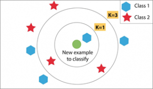
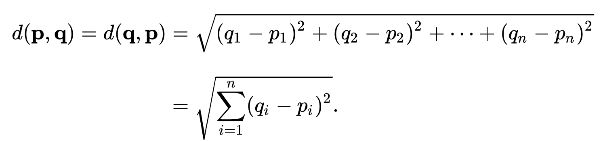

# Implement-KNN-For-Classification-From-Scratch-Using-Python-Numpy

  # Introduction of K-Nearest Neighbors
    - Is very simple, easy to understand, versatile and one of the top most machine learning algorithms.
    - Is a method that simply observes what kind of data, 
      is lies nearest to the one it's trying to predict.
    - Is a type of supervised machine learning algorithms.
    
  # K-Nearest Neighbors
    - Is a non-parametric algorithm learining, 
      which means the model structure determined from the datasets.
    - Is a lazy algorithm, where the function is only approximated locally,
      and all computation is deferred until function evaluation.
    - Is costly testing phase, which means it needs more time and memory,
      -- time to scan all data and all points.
      -- memory for storing training data.
    
  # How does KNN work?
    -- Suppose we need to classify P1 point, which labels need to predict ?!
       We have 3 steps to classify any point that we want :-
       
 

       Step One : calculate distance function (ex. Euclidean Distance) :- 
                  You calculate the distance between P1 point and all points in training data,
                  using the following equation of euclidean distance.
                  
        
  
       Step Two : get nearest neighbors :- 
                  You find "K" closest P1 point after calculate the distance.
                  
   

       Step Three : make predictions :- 
                    classify P1 point by return the most represented class among the neighbors.
                    
                  
  # Result
    
       I implemented KNN from scratch using numpy only, and then applied it by using sklearn, 
       on the same data i'v used in training and test and compared it using accuracy of classifier.
       
       I applied my implemented KNN from scratch on iris data, and the same as in KNN using sklearn,
        and this the result of accuracy used different K-neighbors.
     

<figure>
  

  <figcaption>Accuracy From applied python sklearn</figcaption>
  
  <figcaption>Accuaracy From applied Implemented KNN from scratch</figcaption>
   

</figure>

  # Cross-Validation Overview
    We saw in previous graph their various value of k and it's accuracy of classifier,
    and at this point we can look at the graph and choose the best K to use it in classifier,
    but this was take more time and memory and not good to use it to choose the best K,
    and also another point we know here train data, test data and we applied KNN clasifier, 
    and we can see the result of predictions and accuracy,so when we don't have test data,
     --> What we are doing? and here an important question:
     --> What is the best value of K ?
     --> How to we decide which K is the best?
     The answer is :- 
     We applying Cross-Validation !!!
     
  # How Does Cross-Validation work ?
    First : choose number of fold that you want to use it in dividing training data.
    Second : take training set and divide it into number of fold you've choosed equal chunks (called it S)
    Third : for each pieces S(i --> number of fold): 
              suppose you work on S1
                1 - take this chunck S1 and think of it as test data.
                2 - take the remaining chuck (S-S1) as training set.
                3 - each point in S1 will classify using remaining points,
                    and will give us an "error rate"
    Fourth : done step three for each pieces, loop through it.
    Fifth : we have numberes of "error rate" equal number of fold.
    Sixth : then we average the "error rate" by summation "error rate in each loop" then divide it by number of fold,
            we get an "estimate error",
            which means the final estimate of the error of KNN for a specific value of K.
    Seventh and last step : experiment with multiple values of k = 1 , 3 , 5 , ...
                            and pick the k with the lowest "esstimate error"
                            
 
   
